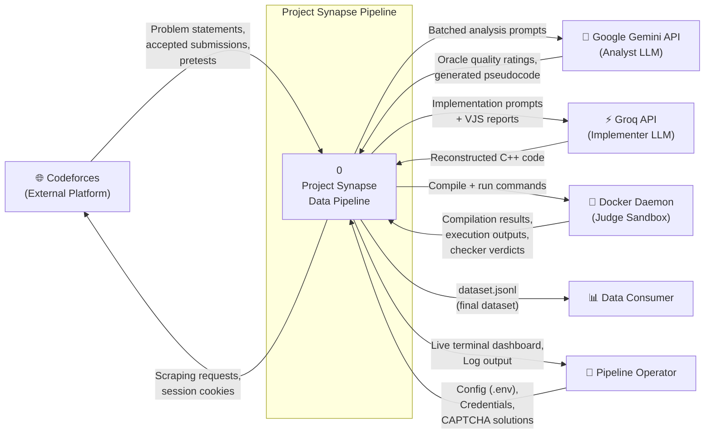
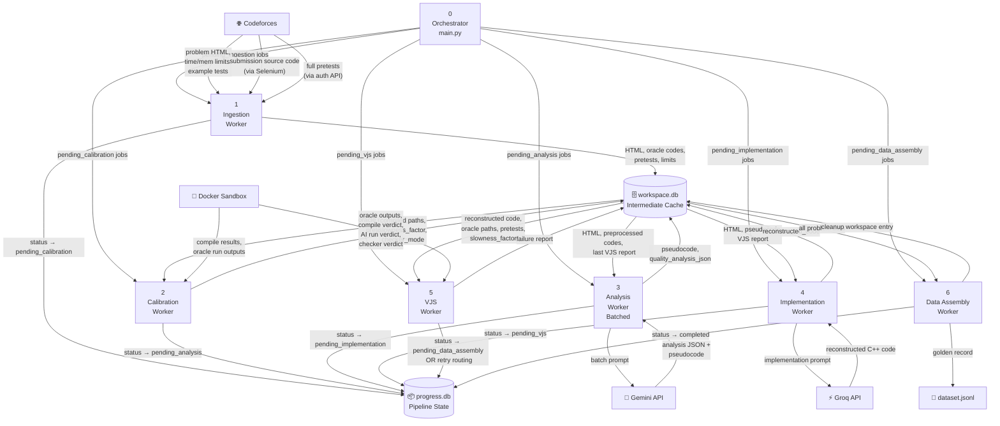
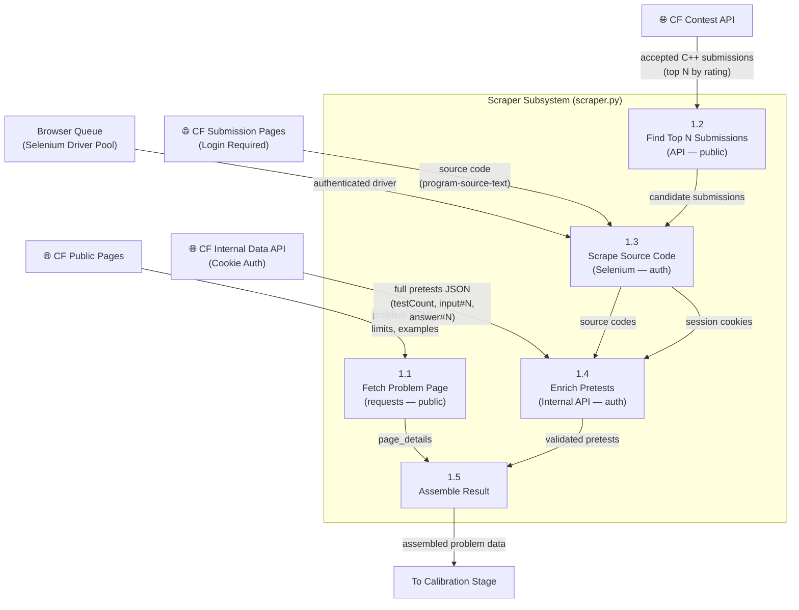
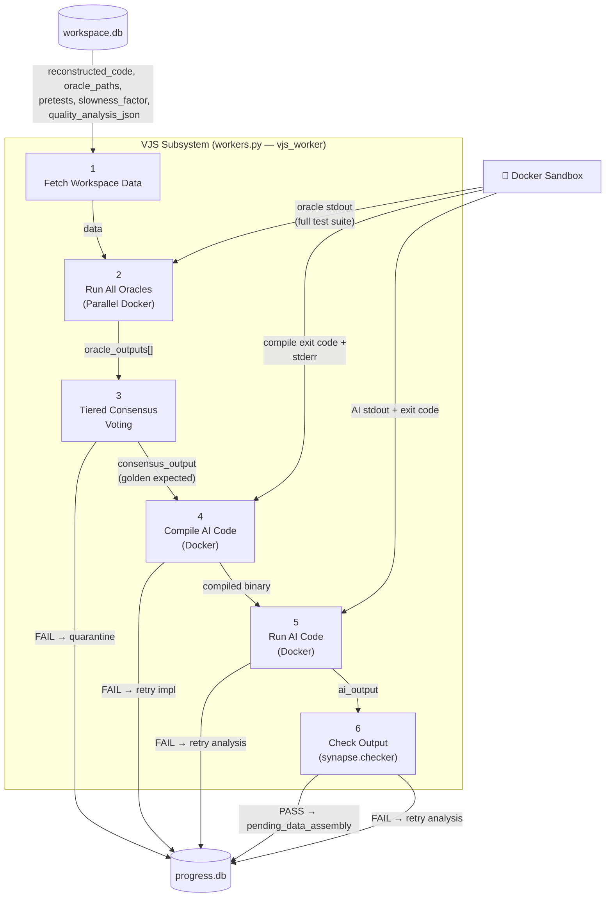

# Data Flow Diagrams (DFD) — Project Synapse

---

## Level 0 — Context Diagram

The context diagram shows Project Synapse as a single process interacting with all external entities.

---

## Level 1 — Main Pipeline DFD

This diagram decomposes the pipeline into its 6 primary processing stages with data stores.

---

## Level 2 — Scraper Subsystem DFD

Detailed data flows within the Ingestion Stage's hybrid scraping strategy.

---

## Level 2 — VJS Subsystem DFD

Detailed data flows within the Verification & Judging Stage.

