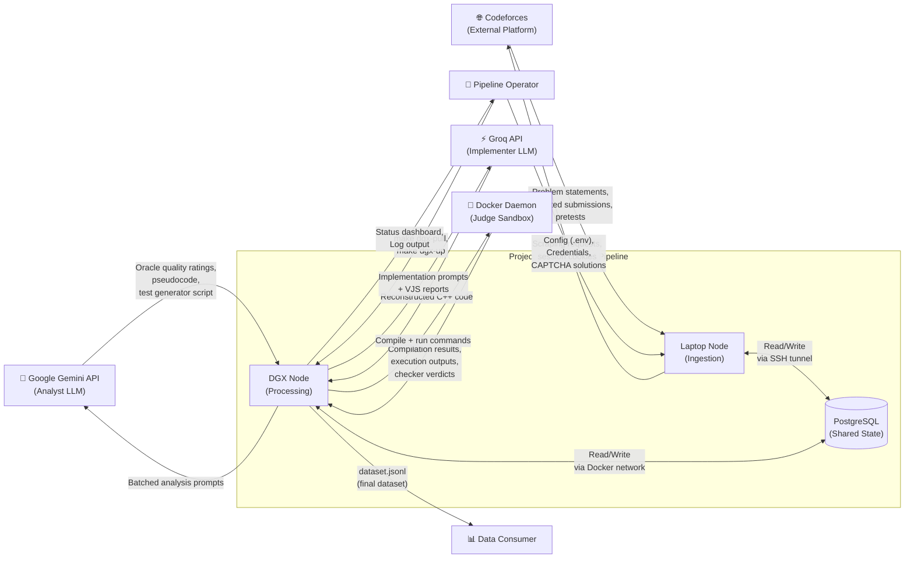
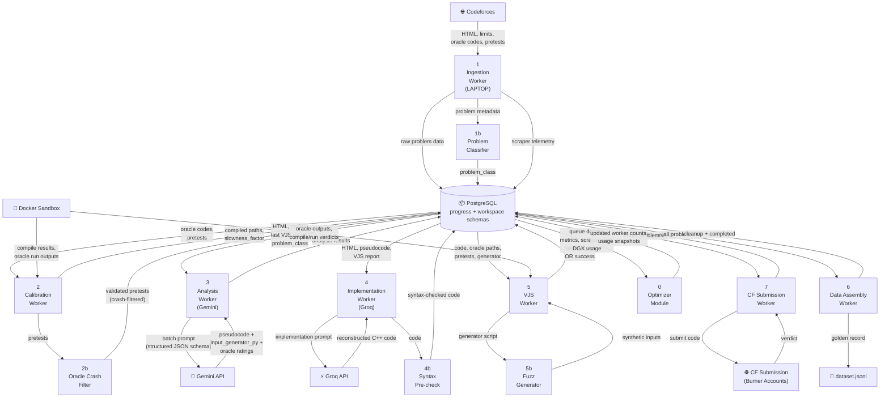
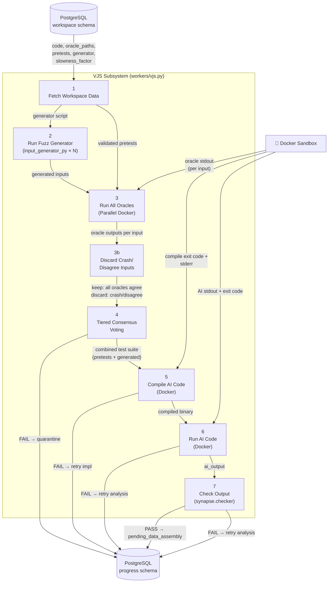
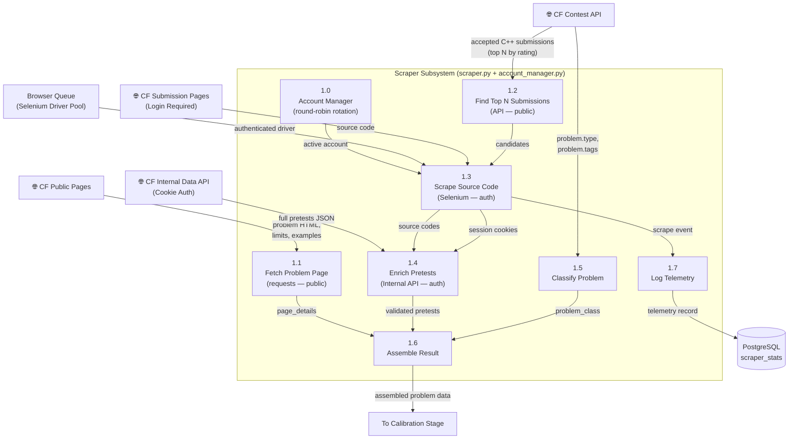

# Data Flow Diagrams (DFD) — Project Synapse v2.0

---

## Level 0 — Context Diagram

---

## Level 1 — Main Pipeline DFD

---

## Level 2 — VJS Subsystem DFD (with Fuzz Generator)

---

## Level 2 — Scraper Subsystem DFD (Multi-Account)

