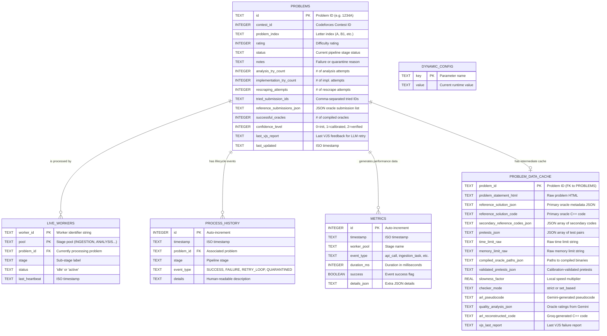

# Entity-Relationship Diagram (ERD) — Project Synapse

This diagram covers both databases: `progress.db` (pipeline state) and `workspace.db` (intermediate cache).

---

## Complete ERD



---

## Attribute Details & Enumerated Values

### `PROBLEMS.status` — Valid States

| Status Value | Description |
|---|---|
| `pending_ingestion` | Awaiting scraper |
| `in_progress_ingestion` | Being scraped |
| `pending_calibration` | Awaiting oracle compilation |
| `in_progress_calibration` | Oracles being compiled/run |
| `pending_analysis` | Awaiting Gemini analysis |
| `in_progress_analysis` | Gemini API in flight |
| `pending_rescraping` | Awaiting re-scrape (new oracle) |
| `in_progress_rescraping` | Being re-scraped |
| `pending_implementation` | Awaiting Groq implementation |
| `in_progress_implementation` | Groq API in flight |
| `pending_vjs` | Awaiting Docker verification |
| `in_progress_vjs` | Docker judging in progress |
| `pending_data_assembly` | Awaiting final record assembly |
| `in_progress_data_assembly` | Record being assembled |
| `completed` | Dataset record written |
| `quarantined` | Permanently excluded |
| `failed_ingestion` | Transient ingestion failure |
| `failed_calibration` | Transient calibration failure |
| `failed_analysis` | Transient analysis failure |
| `failed_implementation` | Transient implementation failure |
| `failed_vjs` | Transient VJS failure |
| `failed_data_assembly` | Transient assembly failure |

### `DYNAMIC_CONFIG.key` — Optimizer Levers

| Key | Default | Min | Max | Description |
|---|---|---|---|---|
| `ingestion_worker_count` | 1 | 0 | 2 | Active scraper threads |
| `analysis_worker_count` | 4 | 1 | 8 | Active Gemini API threads |
| `implementation_worker_count` | 4 | 1 | 8 | Active Groq API threads |
| `vjs_worker_count` | 2 | 1 | 4 | Active Docker judge threads |
| `data_assembly_worker_count` | 1 | 1 | 2 | Active assembly threads |
| `analysis_batch_size` | 5 | 1 | — | Problems per Gemini API call |
| `scraper_delay_seconds` | 2.5 | 2.5 | 10.0 | Delay between scraper requests |

---

## Cross-Database Relationship

Although stored in separate SQLite files, `problem_id` is the linking key between `progress.db` and `workspace.db`:

```
progress.db::problems.id  ←——————— (logical FK) ———————→  workspace.db::problem_data_cache.problem_id
```

The workspace entry is created on ingestion and **deleted** upon completion (Data Assembly Stage), making `workspace.db` a purely transient store.
