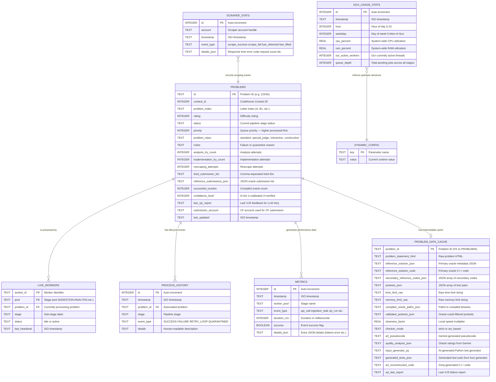

# Entity-Relationship Diagram (ERD) — Project Synapse v2.0

This diagram covers the PostgreSQL database with two schemas: `progress` (pipeline state) and `workspace` (intermediate cache).

---


## Complete ERD



---

## Attribute Details & Enumerated Values

### `PROBLEMS.status` — Valid States

| Status Value | Description | Machine |
|---|---|---|
| `pending_ingestion` | Awaiting scraper | Laptop |
| `in_progress_ingestion` | Being scraped | Laptop |
| `pending_calibration` | Awaiting oracle compilation | DGX |
| `in_progress_calibration` | Oracles being compiled/run | DGX |
| `pending_analysis` | Awaiting Gemini analysis | DGX |
| `in_progress_analysis` | Gemini API in flight | DGX |
| `pending_rescraping` | Awaiting re-scrape (new oracle) | Laptop |
| `in_progress_rescraping` | Being re-scraped | Laptop |
| `pending_implementation` | Awaiting Groq implementation | DGX |
| `in_progress_implementation` | Groq API in flight | DGX |
| `pending_vjs` | Awaiting Docker verification | DGX |
| `in_progress_vjs` | Docker judging in progress | DGX |
| `pending_cf_submission` | Awaiting CF submission (interactive/special) | DGX |
| `in_progress_cf_submission` | CF submission pending verdict | DGX |
| `pending_data_assembly` | Awaiting final record assembly | DGX |
| `in_progress_data_assembly` | Record being assembled | DGX |
| `completed` | Dataset record written | — |
| `quarantined` | Permanently excluded | — |
| `failed_*` | Transient failure, retried with higher priority | — |

### `PROBLEMS.problem_class` — Classification

| Class | Detection | Pipeline Route |
|-------|-----------|----------------|
| `standard` | Default | → VJS (local Docker) |
| `special_judge` | CF tags / "you may print any" | → VJS then CF Submission Worker |
| `interactive` | `type: INTERACTIVE` from CF API | → CF Submission Worker directly |
| `constructive` | "output any valid" in statement | → VJS with oracle-as-verifier |

### `DYNAMIC_CONFIG.key` — Optimizer Levers

| Key | Default | Min | Max | Description |
|---|---|---|---|---|
| `ingestion_worker_count` | 1 | 0 | 2 | Active scraper threads (laptop) |
| `calibration_worker_count` | 1 | 0 | 2 | Active calibration threads (DGX) |
| `analysis_worker_count` | 4 | 0 | 8 | Active Gemini API threads (DGX) |
| `implementation_worker_count` | 4 | 0 | 8 | Active Groq API threads (DGX) |
| `vjs_worker_count` | 2 | 0 | 4 | Active Docker judge threads (DGX) |
| `cf_submission_worker_count` | 1 | 0 | 2 | Active CF submission threads (DGX) |
| `data_assembly_worker_count` | 1 | 0 | 2 | Active assembly threads (DGX) |
| `analysis_batch_size` | 5 | 1 | — | Problems per Gemini API call |
| `scraper_delay_seconds` | 2.5 | 2.5 | 10.0 | Delay between scraper requests |

---

## Database Architecture

```
                     PostgreSQL 16 (DGX Docker)
                    ┌─────────────────────────────────────┐
                    │  synapse_db                          │
                    │                                      │
                    │  ┌── progress schema ──────────────┐ │
                    │  │  problems                       │ │
                    │  │  live_workers                    │ │
                    │  │  metrics                        │ │
                    │  │  process_history                │ │
                    │  │  dynamic_config                 │ │
                    │  │  scraper_stats                  │ │
                    │  │  dgx_usage_stats                │ │
                    │  └─────────────────────────────────┘ │
                    │                                      │
                    │  ┌── workspace schema ─────────────┐ │
                    │  │  problem_data_cache              │ │
                    │  └─────────────────────────────────┘ │
                    └───────────────┬──────────────────────┘
                                    │
                    ┌───────────────┴──────────────────────┐
                    │                                      │
            DGX (Docker network)              Laptop (SSH tunnel)
            pipeline container                ingestion_node.py
            main.py                           :5432 → localhost:5432
```
