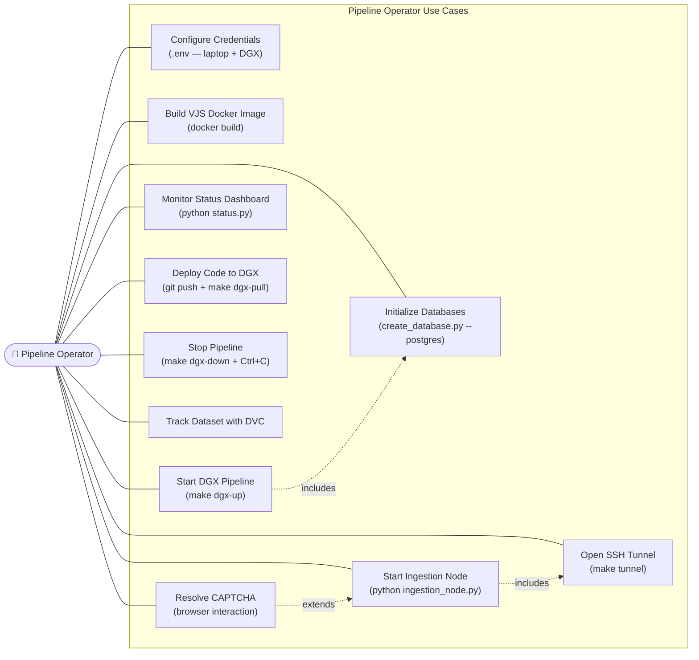
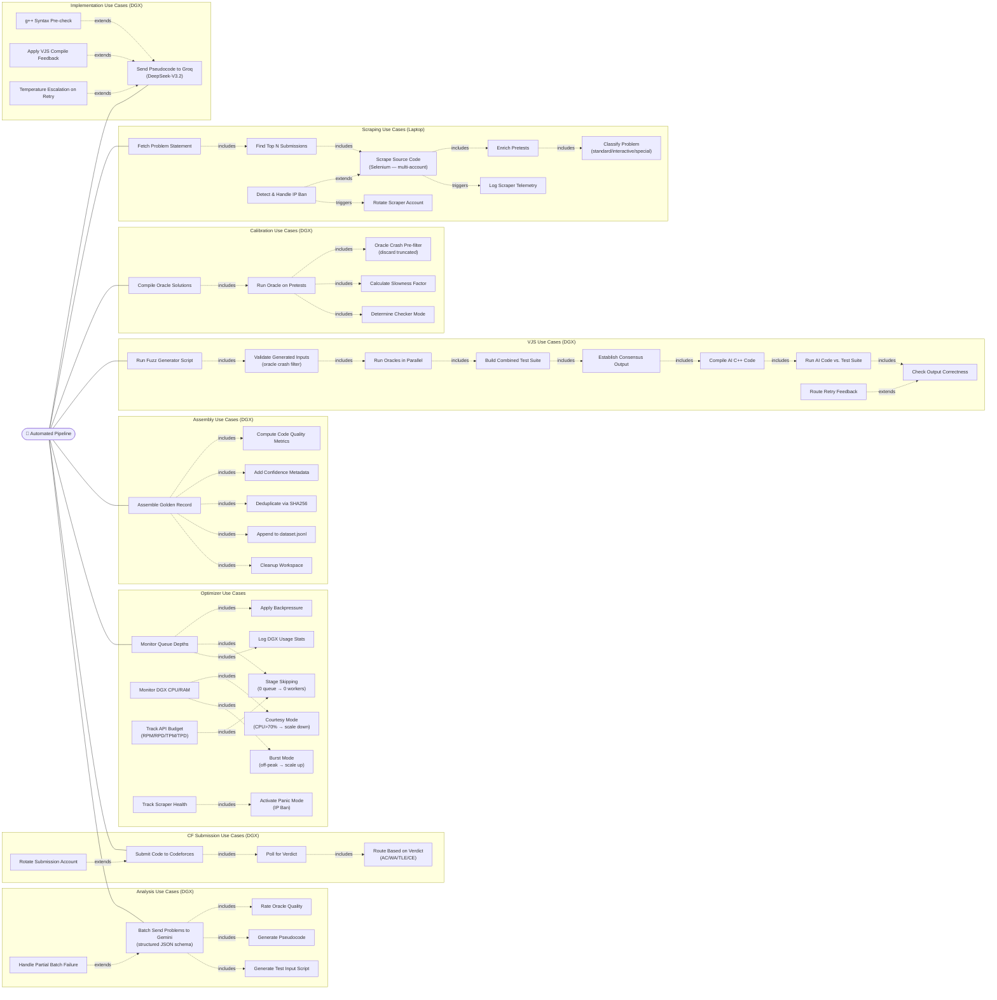

# Use Case Diagrams — Project Synapse v2.0

---

## Use Case Diagram 1: Pipeline Operator

---

## Use Case Diagram 2: Automated Pipeline Actor

---

## Key Use Case Descriptions

### UC-HYBRID: Start Hybrid Pipeline

**Actor:** Pipeline Operator  
**Description:** Launch the distributed pipeline across laptop and DGX  
**Preconditions:**
- `.env` file on both machines
- PostgreSQL schemas initialized
- `synapse-judge` Docker image built on DGX

**Main Flow:**
1. Operator runs `make dgx-pull` → pulls latest code to DGX
2. Operator runs `make dgx-up` → starts postgres + pipeline containers
3. Operator runs `make tunnel` → SSH tunnel to DGX PostgreSQL
4. Operator runs `python ingestion_node.py` → starts ingestion
5. DGX pipeline auto-starts via Docker Compose

**Postconditions:** Laptop scrapes CF, DGX processes all other stages

---

### UC-OPT: Intelligent Optimization

**Actor:** Automated Optimizer  
**Description:** Monitor and tune pipeline based on 7 data sources  
**Preconditions:** PostgreSQL accessible, psutil available

**Main Flow:**
1. Read queue depths — identify empty stages for skipping
2. Read DGX CPU/RAM — switch between courtesy/normal/burst mode
3. Read API budgets from KeyManager — throttle if near limits
4. Read scraper stats — detect bans, calculate safe rates
5. Read historical patterns — identify best hours for burst
6. Apply backpressure if downstream stages overloaded
7. Write updated config to dynamic_config
8. Log usage snapshot to dgx_usage_stats
9. Sleep 30 seconds, repeat

**Postconditions:** Worker counts adjusted; main pipeline adapts within 1 cycle
