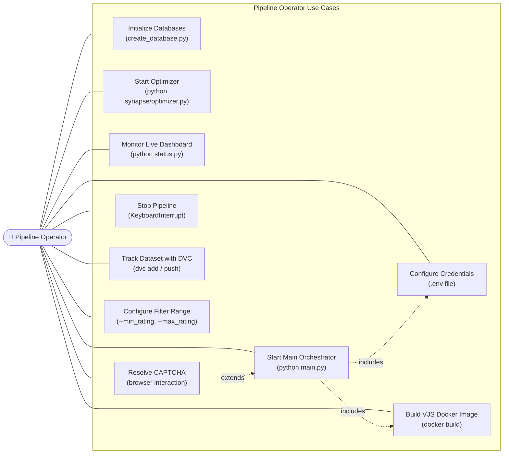
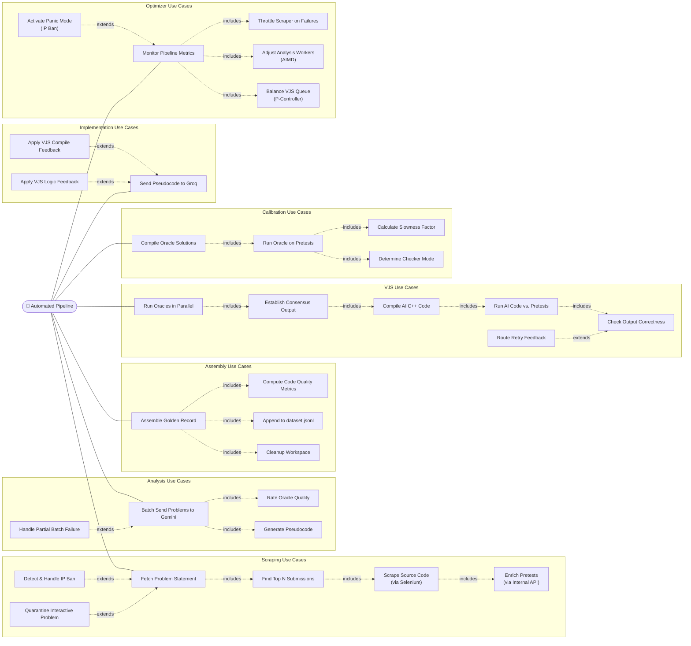
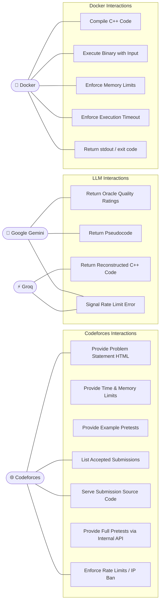

# Use Case Diagrams — Project Synapse

---

## Use Case Diagram 1: Pipeline Operator

---

## Use Case Diagram 2: Automated Pipeline Actor

---

## Use Case Diagram 3: External Systems

---

## Key Use Case Descriptions

### UC-SP: Start Pipeline

**Actor:** Pipeline Operator  
**Description:** Launch main orchestrator, optimizer, and status dashboard  
**Preconditions:**
- `.env` file populated with valid credentials
- `progress.db` and `workspace.db` initialized
- `synapse-judge` Docker image built

**Main Flow:**
1. Operator runs `python main.py`
2. System resets all worker statuses to idle
3. System starts `db_writer` background thread
4. System initializes `KeyManager` for Gemini and Groq
5. System starts `KeyHealthMonitor` background thread
6. System enters main dispatch loop
7. Operator runs `python synapse/optimizer.py`
8. Operator runs `python status.py`

**Postconditions:** Pipeline is actively processing problems

---

### UC-VJS: Verify Problem

**Actor:** Automated Pipeline  
**Description:** Verify AI-generated code correctness using oracle consensus  
**Preconditions:** Problem is in `pending_vjs` state; workspace has code + oracle paths + pretests

**Main Flow:**
1. Fetch workspace data for problem
2. Run all compiled oracle binaries in parallel on full pretest suite
3. Compute weighted consensus output (Tier 1)
4. If Tier 1 fails, run trusted council recount (Tier 2)
5. If consensus found, compile AI code in Docker
6. Run AI binary on same input, compare to consensus output
7. If output matches: transition to `pending_data_assembly`
8. If compile failure: route back to `pending_implementation` with stderr report
9. If runtime/logic failure: route back to `pending_analysis` with failure report

**Postconditions:** Problem moves forward or retry is initiated

---

### UC-OPT: Optimize Pipeline

**Actor:** Automated Optimizer  
**Description:** Monitor and tune pipeline parameters  
**Preconditions:** `progress.db` exists and is accessible

**Main Flow:**
1. Sync dynamic config from DB
2. Query recent metrics (last 5 minutes)
3. Check for IP ban → activate PANIC MODE if detected
4. Check ingestion failure rate → adjust scraper delay
5. Check API rate limits → apply AIMD to analysis workers
6. Check VJS queue depth → apply P-control to analysis workers
7. Sleep for 60 seconds
8. Repeat

**Postconditions:** `dynamic_config` table updated; main pipeline adapts within 1 cycle
