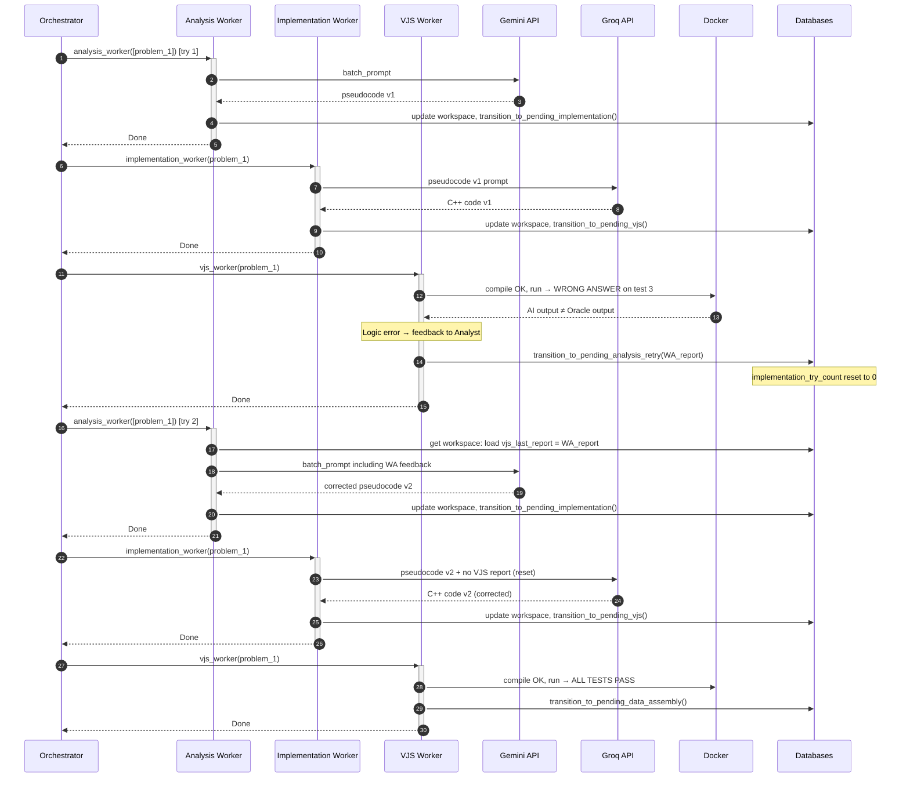

# Sequence Diagrams — Project Synapse

---

## Sequence 1: Full Happy-Path Pipeline

This diagram shows the complete lifecycle of a single problem from initial ingestion to dataset completion.

```mermaid
sequenceDiagram
    autonumber
    actor OP as Operator
    participant ORCH as Orchestrator<br/>(main.py)
    participant ING as Ingestion<br/>Worker
    participant CAL as Calibration<br/>Worker
    participant ANA as Analysis<br/>Worker
    participant IMP as Implementation<br/>Worker
    participant VJS as VJS Worker
    participant ASM as Assembly<br/>Worker
    participant CF as Codeforces
    participant GEM as Gemini API
    participant GROQ as Groq API
    participant DOC as Docker
    participant DB as progress.db<br/>workspace.db

    OP->>ORCH: python main.py
    ORCH->>DB: reset_all_workers_to_idle()
    ORCH->>DB: sync dynamic_config
    ORCH->>DB: get_next_jobs('pending_ingestion', N)
    DB-->>ORCH: [problem_1]

    %% === INGESTION ===
    rect rgb(0, 60, 80)
        ORCH->>+ING: ingestion_worker(problem_1, browser_queue)
        ING->>CF: GET /problemset/problem/{id} (requests)
        CF-->>ING: Problem HTML, limits, examples
        ING->>CF: GET /api/contest.status (parallel requests)
        CF-->>ING: Top N accepted C++ submissions
        ING->>CF: GET /contest/{id}/submission/{id} (Selenium)
        CF-->>ING: Source code for each oracle
        ING->>CF: POST /data/submitSource (cookie auth)
        CF-->>ING: Full pretests JSON
        ING->>DB: save_multi_oracle_ingestion_data()
        ING->>DB: transition_to_pending_calibration()
        ING-->>-ORCH: Done (idle)
    end

    %% === CALIBRATION ===
    rect rgb(0, 80, 60)
        ORCH->>+CAL: calibration_worker(problem_1)
        CAL->>DB: get_batch_data_from_workspace()
        DB-->>CAL: oracle codes, pretests
        CAL->>DOC: docker run [compile oracle_0] (compile_only)
        DOC-->>CAL: compiled binary path
        CAL->>DOC: docker run [compile oracle_1..N] (parallel)
        DOC-->>CAL: compiled binary paths
        CAL->>DOC: docker run [run oracle_0 on pretest]
        DOC-->>CAL: execution output
        CAL->>DB: save_calibration_results(oracles, slowness_factor, checker_mode)
        CAL->>DB: transition_to_pending_analysis()
        CAL-->>-ORCH: Done (idle)
    end

    %% === ANALYSIS ===
    rect rgb(80, 0, 80)
        ORCH->>+ANA: analysis_worker([problem_1, ...], gemini_km)
        ANA->>DB: get_batch_data_from_workspace(batch_ids)
        DB-->>ANA: HTML + oracle codes for each problem
        Note over ANA: Preprocess codes, select top 3 by quality score
        ANA->>GEM: generate_content(batch_prompt)
        GEM-->>ANA: { analysis: {oracle_ratings}, final_pseudocode: {...} }
        ANA->>DB: update_workspace_with_analysis_results(pseudocode, quality_json)
        ANA->>DB: transition_batch_to_pending_implementation()
        ANA-->>-ORCH: Done (idle)
    end

    %% === IMPLEMENTATION ===
    rect rgb(80, 60, 0)
        ORCH->>+IMP: implementation_worker(problem_1, groq_km)
        IMP->>DB: get_batch_data_from_workspace()
        DB-->>IMP: HTML + pseudocode
        IMP->>GROQ: chat.completions.create(impl_prompt)
        GROQ-->>IMP: Raw C++ code
        Note over IMP: _sanitize_cpp_code()
        IMP->>DB: update_workspace_with_implementation_results()
        IMP->>DB: transition_to_pending_vjs()
        IMP-->>-ORCH: Done (idle)
    end

    %% === VJS ===
    rect rgb(0, 0, 100)
        ORCH->>+VJS: vjs_worker(problem_1)
        VJS->>DB: get_batch_data_from_workspace()
        DB-->>VJS: reconstructed_code, oracle_paths, pretests, slowness_factor, oracle_ratings
        par Run all oracles in parallel
            VJS->>DOC: docker run oracle_0 < full_input
            VJS->>DOC: docker run oracle_1 < full_input
            VJS->>DOC: docker run oracle_2 < full_input
        end
        DOC-->>VJS: oracle outputs
        Note over VJS: Tiered weighted consensus vote
        VJS->>DOC: docker run [g++ compile main.cpp]
        DOC-->>VJS: Compile OK
        VJS->>DOC: docker run ./main < golden_input
        DOC-->>VJS: AI output
        VJS->>VJS: python -m synapse.checker golden.in ai.out golden.out
        Note over VJS: Checker returns 0 → PASS
        VJS->>DB: transition_to_pending_data_assembly()
        VJS-->>-ORCH: Done (idle)
    end

    %% === DATA ASSEMBLY ===
    rect rgb(20, 80, 20)
        ORCH->>+ASM: data_assembly_worker(problem_1)
        ASM->>DB: get_batch_data_from_workspace()
        DB-->>ASM: All problem data
        Note over ASM: _assemble_golden_record(): lizard + cppcheck metrics
        ASM->>ASM: append_to_dataset(golden_record) → dataset.jsonl
        ASM->>ASM: shutil.rmtree(oracle_temp_dirs)
        ASM->>DB: delete_data_from_workspace()
        ASM->>DB: transition_to_completed()
        ASM-->>-ORCH: Done (idle)
    end
```



---

## Sequence 2: Retry Loop (VJS Compile Failure → Implementation Retry)

```mermaid
sequenceDiagram
    autonumber
    participant ORCH as Orchestrator
    participant IMP as Implementation Worker
    participant VJS as VJS Worker
    participant GROQ as Groq API
    participant DOC as Docker
    participant DB as Databases

    ORCH->>+IMP: implementation_worker(problem_1) [try 1]
    IMP->>GROQ: Prompt: pseudocode only, no VJS report
    GROQ-->>IMP: C++ code (with syntax error)
    IMP->>DB: update workspace with code
    IMP->>DB: transition_to_pending_vjs()
    IMP-->>-ORCH: Done

    ORCH->>+VJS: vjs_worker(problem_1)
    VJS->>DOC: docker run g++ compile → COMPILE ERROR
    DOC-->>VJS: stderr: "error: expected ';'"
    VJS->>DB: transition_to_pending_implementation_retry(compile_stderr)
    VJS-->>-ORCH: Done

    ORCH->>+IMP: implementation_worker(problem_1) [try 2]
    IMP->>DB: check implementation_try_count = 1 < MAX (5) → OK
    IMP->>DB: get workspace: load last_vjs_report = compile_stderr
    IMP->>GROQ: Prompt: pseudocode + VJS compile error report
    GROQ-->>IMP: Fixed C++ code
    IMP->>DB: update workspace with fixed code
    IMP->>DB: transition_to_pending_vjs()
    IMP-->>-ORCH: Done

    ORCH->>+VJS: vjs_worker(problem_1)
    VJS->>DOC: docker run g++ compile → OK
    VJS->>DOC: docker run ./main → outputs match oracles
    VJS->>DB: transition_to_pending_data_assembly()
    VJS-->>-ORCH: Done
```

---

## Sequence 3: Analysis Retry Loop (Logic Failure → Re-analysis)



---

## Sequence 4: Optimizer Intervention (API Rate Limit)

```mermaid
sequenceDiagram
    autonumber
    participant OPT as Optimizer Process
    participant ORCH as Orchestrator
    participant ANA as Analysis Workers (N)
    participant GEM as Gemini API
    participant DB as progress.db

    Note over OPT: Runs every 60 seconds independently

    ANA->>GEM: API Call [existing workers]
    GEM-->>ANA: 429 RATE_LIMITED error
    ANA->>DB: log_metric(ANALYSIS, api_call, success=False, "rate")

    OPT->>DB: sync dynamic_config
    OPT->>DB: SELECT FROM metrics WHERE worker_pool='ANALYSIS' AND success=0 AND details='rate...' (last 5 min)
    DB-->>OPT: rate_limited = True
    Note over OPT: AIMD: Multiplicative decrease (× 0.5)
    OPT->>DB: SET dynamic_config['analysis_worker_count'] = max(1, N/2)

    ORCH->>DB: sync_from_db() [next cycle]
    DB-->>ORCH: analysis_worker_count = N/2
    Note over ORCH: manage_pools() detects change
    ORCH->>ORCH: Shutdown old pool, create smaller pool (N/2 workers)

    Note over OPT: Next cycle: no rate limit detected
    OPT->>DB: SELECT FROM metrics... → rate_limited = False
    Note over OPT: P-Controller: VJS queue needs feeding
    OPT->>DB: SET dynamic_config['analysis_worker_count'] = N/2 + 1

    ORCH->>DB: sync_from_db() [next cycle]
    DB-->>ORCH: analysis_worker_count = N/2 + 1
    ORCH->>ORCH: Resize pool to N/2 + 1 workers
```

---

## Sequence 5: IP Ban — PANIC MODE

```mermaid
sequenceDiagram
    autonumber
    participant ING as Ingestion Worker
    participant OPT as Optimizer
    participant DB as progress.db
    participant ORCH as Orchestrator

    ING->>ING: GET codeforces.com/... → "blocked by administrator"
    Note over ING: Raises IPBanException
    ING->>DB: log_metric(INGESTION, scrape_blocked, success=False)
    ING->>DB: transition_to_failed(problem_id, 'ingestion', 'IP_BAN_DETECTED')

    OPT->>DB: SELECT 1 FROM metrics WHERE event_type='scrape_blocked' (last 5 min)
    DB-->>OPT: row found → is_ip_banned = True
    Note over OPT: PANIC MODE activated!
    OPT->>DB: SET dynamic_config['ingestion_worker_count'] = 0
    OPT->>OPT: time.sleep(7200)  # 2 hour pause

    ORCH->>DB: sync_from_db()
    DB-->>ORCH: ingestion_worker_count = 0
    ORCH->>ORCH: manage_pools() → shutdown ingestion pool

    Note over OPT: 2 hours later...
    OPT->>DB: SET dynamic_config['ingestion_worker_count'] = 1
    Note over OPT: Gradual recovery

    ORCH->>DB: sync_from_db()
    DB-->>ORCH: ingestion_worker_count = 1
    ORCH->>ORCH: manage_pools() → create new ingestion pool (1 worker)
```
