# Sequence Diagrams — Project Synapse v2.0

---

## Sequence 1: Full Happy-Path Pipeline (Hybrid)

```mermaid
sequenceDiagram
    autonumber
    actor OP as Operator
    participant LPT as Laptop<br/>(ingestion_node.py)
    participant PG as PostgreSQL<br/>(DGX)
    participant DGX as DGX Pipeline<br/>(main.py)
    participant CF as Codeforces
    participant GEM as Gemini API<br/>(2.5 Pro)
    participant GROQ as Groq API<br/>(DeepSeek-V3.2)
    participant DOC as Docker<br/>(synapse-judge)

    OP->>LPT: make tunnel + python ingestion_node.py
    OP->>DGX: make dgx-up (docker compose)

    %% === INGESTION (LAPTOP) ===
    rect rgb(0, 60, 80)
        Note over LPT: LAPTOP — Ingestion
        LPT->>PG: get_next_jobs('pending_ingestion', N)
        PG-->>LPT: [problem_1]
        LPT->>CF: GET /problemset/problem/{id}
        CF-->>LPT: Problem HTML, limits
        LPT->>CF: GET /api/contest.status
        CF-->>LPT: Top N C++ submissions
        LPT->>CF: GET submission source (Selenium)
        CF-->>LPT: Oracle source codes
        LPT->>CF: POST /data/submitSource (cookie)
        CF-->>LPT: Full pretests JSON
        LPT->>LPT: classify_problem(type, tags, statement)
        LPT->>PG: save data + problem_class + scraper_stats
        LPT->>PG: transition_to_pending_calibration()
    end

    %% === CALIBRATION (DGX) ===
    rect rgb(0, 80, 60)
        Note over DGX: DGX — Calibration + Oracle Crash Filter
        DGX->>PG: get_next_jobs('pending_calibration', N)
        PG-->>DGX: [problem_1]
        DGX->>DOC: compile oracle_0..N (parallel)
        DOC-->>DGX: compiled binary paths
        DGX->>DOC: run oracles on each pretest
        DOC-->>DGX: oracle outputs
        Note over DGX: Discard pretests where oracles crash or disagree
        DGX->>PG: save calibration (validated_pretests, slowness_factor)
        DGX->>PG: transition_to_pending_analysis()
    end

    %% === ANALYSIS (DGX) ===
    rect rgb(80, 0, 80)
        Note over DGX: DGX — Analysis (Gemini)
        DGX->>PG: get_next_jobs('pending_analysis', batch)
        PG-->>DGX: [problem_1, ...]
        DGX->>GEM: generate_content(batch_prompt, JSON schema)
        GEM-->>DGX: {pseudocode, input_generator_py, oracle_ratings}
        DGX->>PG: save analysis results + generator script
        DGX->>PG: transition to pending_implementation
    end

    %% === IMPLEMENTATION (DGX) ===
    rect rgb(80, 60, 0)
        Note over DGX: DGX — Implementation (Groq)
        DGX->>PG: get_next_jobs('pending_implementation', N)
        PG-->>DGX: [problem_1]
        DGX->>GROQ: chat.completions.create(impl_prompt)
        GROQ-->>DGX: C++ code
        Note over DGX: g++ -fsyntax-only pre-check
        DGX->>PG: save reconstructed code
        DGX->>PG: transition to pending_vjs
    end

    %% === VJS (DGX) ===
    rect rgb(0, 0, 100)
        Note over DGX: DGX — VJS + Fuzz Generator
        DGX->>PG: get_next_jobs('pending_vjs', N)
        PG-->>DGX: [problem_1]
        Note over DGX: Run input_generator_py × 20
        par Run all oracles on all inputs (parallel)
            DGX->>DOC: oracle_0..N × (pretests + generated)
        end
        DOC-->>DGX: oracle outputs per test
        Note over DGX: Keep tests where ALL oracles agree
        Note over DGX: Combined suite = validated pretests + validated generated
        DGX->>DOC: g++ compile AI code
        DGX->>DOC: run AI code on combined suite
        DOC-->>DGX: AI output
        Note over DGX: checker: compare AI vs consensus
        DGX->>PG: transition_to_pending_data_assembly()
    end

    %% === ASSEMBLY (DGX) ===
    rect rgb(20, 80, 20)
        Note over DGX: DGX — Data Assembly
        DGX->>PG: get all workspace data
        Note over DGX: assemble golden record + quality metrics
        DGX->>DGX: append to dataset.jsonl (dedup via SHA256)
        DGX->>PG: delete workspace + transition to completed
    end
```



---

## Sequence 2: Optimizer Decision Cycle

```mermaid
sequenceDiagram
    autonumber
    participant OPT as Optimizer Thread
    participant PG as PostgreSQL
    participant SYS as DGX System<br/>(psutil)
    participant KM as KeyManager
    participant CFG as dynamic_config

    Note over OPT: Every 30 seconds

    OPT->>PG: SELECT status, COUNT(*) FROM problems GROUP BY status
    PG-->>OPT: queue_depths = {cal: 0, ana: 12, impl: 5, vjs: 8, asm: 0}

    OPT->>SYS: cpu_percent(), virtual_memory()
    SYS-->>OPT: cpu=45%, ram=62%

    OPT->>KM: get_budget_status('gemini')
    KM-->>OPT: {rpm_remaining: 7, rpd_remaining: 892, tpd_remaining: 1.2M}

    OPT->>KM: get_budget_status('groq')
    KM-->>OPT: {rpm_remaining: 28, rpd_remaining: 13200}

    OPT->>PG: SELECT * FROM scraper_stats WHERE event_type='ban_detected' AND timestamp > last_2h
    PG-->>OPT: 0 bans → scraper healthy

    Note over OPT: Apply rules:
    Note over OPT: 1. cal queue=0 → cal_workers=0 (skip)
    Note over OPT: 2. asm queue=0 → asm_workers=0 (skip)
    Note over OPT: 3. CPU 45% → normal mode
    Note over OPT: 4. VJS queue(8) > 2× ana queue(12)? No → no backpressure
    Note over OPT: 5. Gemini budget OK
    Note over OPT: 6. Scale ana=4, impl=3, vjs=3

    OPT->>CFG: UPDATE dynamic_config SET cal=0, ana=4, impl=3, vjs=3, asm=0
    OPT->>PG: INSERT INTO dgx_usage_stats (cpu=45, ram=62, workers=10, queue=25)

    Note over OPT: main.py reads dynamic_config next cycle
    Note over OPT: manage_pools() resizes ThreadPoolExecutors
```

---

## Sequence 3: API Budget Exhaustion (Gemini)

```mermaid
sequenceDiagram
    autonumber
    participant ANA as Analysis Workers
    participant KM as KeyManager
    participant GEM as Gemini API
    participant OPT as Optimizer
    participant CFG as dynamic_config

    ANA->>KM: get_key(estimated_tokens=5000)
    KM-->>ANA: key_1 (tokens_today: 2.3M / 2.5M TPD)

    ANA->>GEM: generate_content(batch_prompt)
    GEM-->>ANA: response (tokens_used: 8000)

    ANA->>KM: release_key(key_1, tokens_used=8000)
    Note over KM: key_1.tokens_today = 2.308M (92% of TPD!)

    OPT->>KM: get_budget_status('gemini')
    KM-->>OPT: tpd_remaining = 192K (< 10% of 2.5M)
    Note over OPT: Rule: >90% TPD → reduce to 1 worker
    OPT->>CFG: SET analysis_worker_count = 1

    Note over ANA: Next cycle: only 1 analysis thread runs

    ANA->>KM: get_key(estimated_tokens=5000)
    KM-->>ANA: key_1 (tokens_today: 2.49M)
    ANA->>GEM: generate_content(small_batch)
    GEM-->>ANA: response (tokens_used: 6000)
    ANA->>KM: release_key(key_1, tokens_used=6000)
    Note over KM: key_1.tokens_today = 2.496M (99.8%!)

    OPT->>KM: get_budget_status('gemini')
    KM-->>OPT: tpd_remaining = 4K (< 2% of 2.5M)
    Note over OPT: Rule: >98% TPD → STOP
    OPT->>CFG: SET analysis_worker_count = 0

    Note over ANA: Analysis paused until midnight reset
```

---

## Sequence 4: Scraper Ban → Account Rotation

```mermaid
sequenceDiagram
    autonumber
    participant ING as Ingestion Worker<br/>(Laptop)
    participant AM as Account Manager
    participant CF as Codeforces
    participant PG as PostgreSQL
    participant OPT as Optimizer

    ING->>AM: get_active_account()
    AM-->>ING: AXE08 (142 scrapes, no recent bans)

    ING->>CF: GET /submission/123 (as AXE08)
    CF-->>ING: "blocked by administrator"
    Note over ING: IPBanException raised!

    ING->>PG: INSERT scraper_stats (AXE08, ban_detected)
    ING->>AM: mark_banned(AXE08)
    Note over AM: AXE08 → COOLING (avg_ban: 2h, cooldown_until: +2h)

    ING->>AM: get_active_account()
    AM-->>ING: ProjectSynapse (89 scrapes, never banned)

    ING->>CF: GET /submission/123 (as ProjectSynapse)
    CF-->>ING: Source code ✅

    Note over OPT: 30 seconds later...
    OPT->>PG: SELECT FROM scraper_stats WHERE ban_detected last 5min
    PG-->>OPT: 1 ban (AXE08)
    Note over OPT: Don't panic — have backup account
    Note over OPT: But increase scraper_delay_seconds by 1.0
    OPT->>PG: UPDATE dynamic_config SET scraper_delay=3.5

    Note over AM: 2 hours later...
    AM-->>AM: AXE08 cooldown expired → AVAILABLE
    ING->>PG: INSERT scraper_stats (AXE08, ban_lifted)
```

---

## Sequence 5: Backpressure — VJS Overloaded

```mermaid
sequenceDiagram
    autonumber
    participant OPT as Optimizer
    participant PG as PostgreSQL
    participant CFG as dynamic_config
    participant ORCH as Orchestrator

    OPT->>PG: COUNT pending_vjs = 45
    OPT->>PG: COUNT pending_analysis = 8
    OPT->>PG: COUNT pending_implementation = 15

    Note over OPT: VJS queue (45) > 2× impl (15) + ana (8)?
    Note over OPT: 45 > 2×23 = 46? Almost — apply mild backpressure

    Note over OPT: Analysis feeds implementation feeds VJS
    Note over OPT: Throttle analysis to stop feeding the overloaded VJS

    OPT->>CFG: SET analysis_worker_count = max(1, current/2) = 2
    OPT->>CFG: SET vjs_worker_count = max_available = 4

    ORCH->>PG: sync_from_db()
    PG-->>ORCH: analysis=2, vjs=4

    Note over ORCH: manage_pools(): shrink analysis pool, grow VJS pool
    Note over ORCH: VJS drains its queue faster, analysis produces less

    Note over OPT: 2 minutes later...
    OPT->>PG: COUNT pending_vjs = 12
    Note over OPT: VJS queue normalized → release backpressure
    OPT->>CFG: SET analysis_worker_count = 4
```
