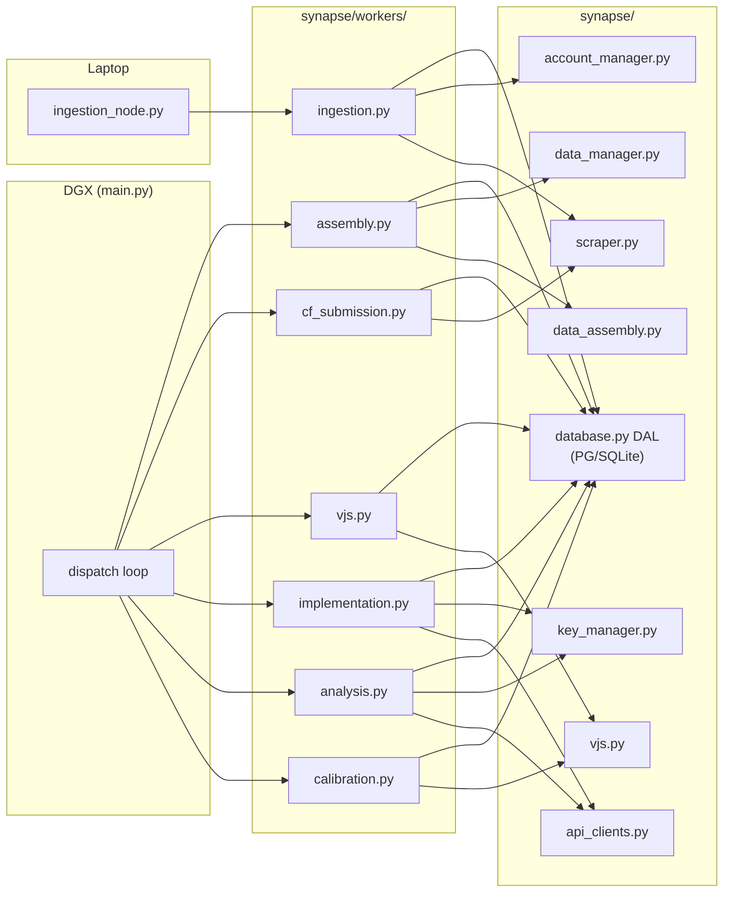

# Class Diagrams — Project Synapse v2.0

---

## Core Class Diagram

```mermaid
classDiagram

    %% ============================================================
    %% main.py — Orchestration Layer (DGX)
    %% ============================================================

    class Orchestrator {
        <<main.py>>
        +DISABLE_INGESTION: bool
        +main(args: Namespace) None
        +manage_pools(current_pools, current_counts) tuple
    }

    %% ============================================================
    %% ingestion_node.py — Laptop Entry Point
    %% ============================================================

    class IngestionNode {
        <<ingestion_node.py>>
        +browser_queue: Queue
        +executor: ThreadPoolExecutor
        +main() None
        +shutdown_handler(signum, frame) None
    }

    %% ============================================================
    %% synapse/key_manager.py — with Budget Tracking
    %% ============================================================

    class KeyStatus {
        <<enumeration>>
        AVAILABLE
        RATE_LIMITED
        INVALID
        EXHAUSTED
    }

    class ManagedKey {
        +key_string: str
        +status: KeyStatus
        +cooldown_until: float
        +request_count_in_window: int
        +token_count_in_window: int
        +requests_today: int
        +tokens_today: int
    }

    class KeyManager {
        -_keys: list~ManagedKey~
        -_lock: Lock
        -_service_name: str
        -_rpm_limit: int
        -_rpd_limit: int
        -_tpm_limit: int
        -_tpd_limit: int
        +__init__(api_keys, service_name, limits)
        +get_key(estimated_tokens) ManagedKey
        +release_key(key, status, tokens_used)
        +log_usage(key, tokens_in, tokens_out)
        +get_budget_status() dict
        +should_throttle() bool
        -_check_and_reset_windows()
    }

    %% ============================================================
    %% synapse/database.py — DAL (PG + SQLite Adapter)
    %% ============================================================

    class DAL {
        <<database.py>>
        +USE_POSTGRES: bool
        +PROGRESS_DB_PATH: str
        +WORKSPACE_DB_PATH: str
        +get_next_jobs(status, limit) list
        +save_multi_oracle_ingestion_data(...)
        +save_calibration_results(...)
        +save_analysis_results(...)
        +save_implementation_result(...)
        +get_batch_data_from_workspace(ids) dict
        +delete_data_from_workspace(id)
        +transition_to_pending_calibration(id)
        +transition_to_pending_analysis(id)
        +transition_to_pending_vjs(id)
        +transition_to_pending_cf_submission(id)
        +transition_to_pending_data_assembly(id)
        +transition_to_pending_implementation_retry(id, report)
        +transition_to_pending_analysis_retry(id, report)
        +transition_to_completed(id)
        +transition_to_quarantined(id, reason)
        +log_metric(pool, event, duration, success, details)
        -_get_db_connection(db_path) Connection
    }

    %% ============================================================
    %% synapse/database_writer.py — PG/SQLite Write Queue
    %% ============================================================

    class DatabaseWriter {
        <<Singleton Thread>>
        -_queue: Queue
        -_thread: Thread
        -_backend: str
        +start()
        +stop()
        +execute(sql, params)
        -_sqlite_worker_loop()
        -_pg_worker_loop()
    }

    %% ============================================================
    %% synapse/config_manager.py
    %% ============================================================

    class ConfigManager {
        <<Singleton>>
        -_config: dict
        -_lock: Lock
        +sync_from_db()
        +get_param(key, default) Any
        +set_param(key, value)
    }

    %% ============================================================
    %% synapse/optimizer.py — Intelligent Optimizer
    %% ============================================================

    class PipelineOptimizer {
        +_cfg: ConfigManager
        +_km_gemini: KeyManager
        +_km_groq: KeyManager
        +optimize()
        -_read_queue_depths() dict
        -_read_dgx_load() tuple
        -_read_api_budgets() dict
        -_read_scraper_health() dict
        -_apply_stage_skipping(depths)
        -_apply_courtesy_mode(cpu)
        -_apply_burst_mode(cpu, depths)
        -_apply_backpressure(depths)
        -_apply_api_throttle(budgets)
        -_apply_panic_mode(scraper)
        -_log_usage_snapshot()
    }

    %% ============================================================
    %% synapse/account_manager.py — Scraper Accounts
    %% ============================================================

    class AccountManager {
        -_accounts: list~ScraperAccount~
        -_lock: Lock
        +get_active_account() ScraperAccount
        +mark_banned(handle)
        +mark_unbanned(handle)
        +get_safe_rate(handle) float
    }

    class ScraperAccount {
        +handle: str
        +password: str
        +status: str
        +total_requests: int
        +blocks_count: int
        +last_block_at: float
        +requests_since_last_block: int
        +cooldown_until: float
    }

    %% ============================================================
    %% synapse/scraper.py
    %% ============================================================

    class Scraper {
        <<scraper.py>>
        +fetch_problem_page_details(contest_id, index) dict
        +get_authenticated_driver(handle, password) Chrome
        +fetch_problem_data(problem_id, driver, exclude_ids) dict
        +classify_problem(type, tags, statement) str
    }

    class IPBanException {
        <<Exception>>
    }

    %% ============================================================
    %% synapse/api_clients.py
    %% ============================================================

    class APIClients {
        <<api_clients.py>>
        +GEMINI_MODEL: str = "gemini-2.5-pro"
        +GROQ_MODEL: str = "deepseek-v3.2-speciale"
        +call_gemini_analyst_batch(data, km) tuple
        +call_groq_implementer(html, pseudo, report, km) str
        -_preprocess_code_for_llm(code) str
        -_sanitize_cpp_code(output) str
    }

    %% ============================================================
    %% synapse/workers/ — Worker Package
    %% ============================================================

    class WorkerPackage {
        <<synapse/workers/__init__.py>>
        +ingestion_worker (conditional import)
        +calibration_worker
        +analysis_worker
        +implementation_worker
        +vjs_worker
        +cf_submission_worker
        +data_assembly_worker
    }

    %% ============================================================
    %% synapse/vjs.py
    %% ============================================================

    class VJS {
        <<vjs.py>>
        +run_vjs(problem_id, code, pretests, ...) dict
        +run_fuzz_generator(generator_py, count) list
        +validate_generated_inputs(inputs, oracles) list
        +build_combined_test_suite(pretests, generated) list
    }

    %% ============================================================
    %% synapse/data_assembly.py
    %% ============================================================

    class DataAssembly {
        <<data_assembly.py>>
        +_assemble_golden_record(id, data) dict
        +_compute_dedup_hash(id, pseudocode) str
        +_parse_time_limit(raw) float
        +_parse_memory_limit(raw) int
    }

    %% ============================================================
    %% status.py — Dashboard
    %% ============================================================

    class Dashboard {
        <<status.py>>
        +main()
        +get_db_data() tuple
        +render_queue_panel() Panel
        +render_workers_panel() Panel
        +render_api_budget_panel() Panel
        +render_scraper_health_panel() Panel
        +render_dgx_resources_panel() Panel
    }

    %% ============================================================
    %% Relationships
    %% ============================================================

    Orchestrator --> KeyManager : creates & uses
    Orchestrator --> WorkerPackage : dispatches to pools
    Orchestrator --> ConfigManager : syncs config
    Orchestrator --> DatabaseWriter : starts/stops
    Orchestrator --> PipelineOptimizer : runs as thread

    IngestionNode --> Scraper : calls
    IngestionNode --> AccountManager : rotates accounts
    IngestionNode --> DAL : reads/writes PG via tunnel

    WorkerPackage --> Scraper : ingestion_worker
    WorkerPackage --> APIClients : analysis + impl workers
    WorkerPackage --> VJS : calibration + vjs workers
    WorkerPackage --> DataAssembly : assembly worker
    WorkerPackage --> DAL : all workers

    APIClients --> KeyManager : get/release keys + log usage
    Scraper --> AccountManager : account rotation
    Scraper --> IPBanException : raises

    PipelineOptimizer --> ConfigManager : reads & writes
    PipelineOptimizer --> KeyManager : reads budget status
    PipelineOptimizer --> DAL : reads stats tables

    DAL --> DatabaseWriter : delegates writes
    Dashboard --> DAL : reads DB (read-only)

    KeyManager --> ManagedKey : manages
    ManagedKey --> KeyStatus : has status
    AccountManager --> ScraperAccount : manages
```

---

## Worker Function Call Chain (Hybrid)

```mermaid
graph LR
    subgraph Laptop
        ING_NODE["ingestion_node.py"]
    end

    subgraph DGX["DGX (main.py)"]
        DISPATCH["dispatch loop"]
    end

    subgraph workers["synapse/workers/"]
        IW["ingestion.py"]
        CW["calibration.py"]
        AW["analysis.py"]
        ImW["implementation.py"]
        VW["vjs.py"]
        CFW["cf_submission.py"]
        DW["assembly.py"]
    end

    subgraph services["synapse/"]
        DB["database.py DAL\n(PG/SQLite)"]
        SC["scraper.py"]
        AM["account_manager.py"]
        AC["api_clients.py"]
        VJS["vjs.py"]
        DA["data_assembly.py"]
        DM["data_manager.py"]
        KM["key_manager.py"]
    end

    ING_NODE --> IW
    DISPATCH --> CW & AW & ImW & VW & CFW & DW

    IW --> SC & AM & DB
    CW --> VJS & DB
    AW --> AC & KM & DB
    ImW --> AC & KM & DB
    VW --> VJS & DB
    CFW --> SC & DB
    DW --> DA & DM & DB
```
