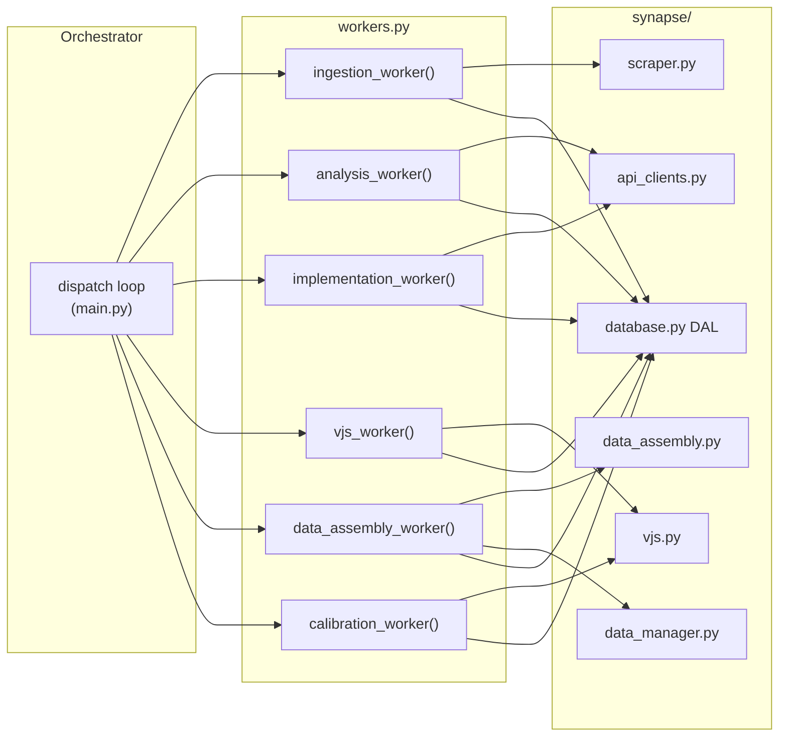

# Class Diagrams — Project Synapse

---

## Core Class Diagram

```mermaid
classDiagram

    %% ============================================================
    %% main.py — Orchestration Layer
    %% ============================================================

    class Orchestrator {
        <<main.py>>
        +GEMINI_API_KEYS: list[str]
        +GROQ_API_KEYS: list[str]
        +main(args: Namespace) None
        +manage_pools(current_pools: dict, current_counts: dict) tuple
        +key_health_monitor(stop_event: Event, gemini_km: KeyManager, groq_km: KeyManager) None
    }

    %% ============================================================
    %% synapse/key_manager.py
    %% ============================================================

    class KeyStatus {
        <<enumeration>>
        AVAILABLE
        RATE_LIMITED
        INVALID
        EXHAUSTED
    }

    class ManagedKey {
        +key_string: str
        +status: KeyStatus
        +cooldown_until: float
        +request_count_in_window: int
        +token_count_in_window: int
    }

    class KeyManager {
        -_keys: list[ManagedKey]
        -_lock: threading.Lock
        -_service_name: str
        +__init__(api_keys: list[str], service_name: str)
        +get_key(estimated_tokens: int) ManagedKey
        +release_key(key: ManagedKey, status: KeyStatus, tokens_used: int)
        -_check_and_reset_windows()
    }

    %% ============================================================
    %% synapse/config_manager.py
    %% ============================================================

    class ConfigManager {
        <<Singleton>>
        -_instance: ConfigManager
        -_config: dict
        -_lock: threading.Lock
        +sync_from_db()
        +get_param(key: str, default: Any) Any
        +set_param(key: str, value: Any)
    }

    %% ============================================================
    %% synapse/database_writer.py
    %% ============================================================

    class DatabaseWriter {
        <<Singleton Thread>>
        -_queue: Queue
        -_thread: Thread
        -_running: bool
        +start()
        +stop()
        +execute(sql: str, params: tuple)
        -_worker_loop()
    }

    %% ============================================================
    %% synapse/scraper.py
    %% ============================================================

    class IPBanException {
        <<Exception>>
    }

    class Scraper {
        <<scraper.py module>>
        +CF_HANDLE: str
        +CF_PASSWORD: str
        +session: requests.Session
        +fetch_problem_page_details(contest_id, problem_index) dict
        +get_authenticated_driver() uc.Chrome
        +fetch_problem_data(problem_id, driver, exclude_ids) dict
        -_parse_pre_tag(pre_tag) str
        -_get_source_from_page(driver, url) str
        -_get_top_submissions(contest_id, problem_index, exclude_ids) list
        -_fetch_submission_page(url) dict
    }

    %% ============================================================
    %% synapse/api_clients.py
    %% ============================================================

    class AnalysisFailedException {
        <<Exception>>
    }

    class APIClients {
        <<api_clients.py module>>
        +GEMINI_MODEL_NAME: str = "gemini-2.5-pro"
        +GROQ_MODEL_NAME: str = "llama-3.3-70b-versatile"
        +GEMINI_ANALYST_BATCH_PROMPT: str
        +GROQ_IMPLEMENTER_PROMPT: str
        +call_gemini_analyst_batch(batch_data, key_manager) Tuple
        +call_groq_implementer(problem_html, pseudocode, vjs_report, key_manager) str
        -_preprocess_code_for_llm(code) str
        -_sanitize_cpp_code(raw_output) str
    }

    %% ============================================================
    %% synapse/vjs.py
    %% ============================================================

    class VJS {
        <<vjs.py module>>
        +run_vjs(problem_id, code, pretests, time_limit_ms, memory_limit_kb, suffix, compile_only) dict
        +run_static_analysis(code) dict
        +run_semantic_analysis(code) dict
    }

    %% ============================================================
    %% synapse/database.py (DAL)
    %% ============================================================

    class DAL {
        <<database.py module>>
        +PROGRESS_DB_PATH: str
        +WORKSPACE_DB_PATH: str
        +get_next_jobs(status, limit) list
        +update_worker_status(worker_id, pool, problem_id, stage, status)
        +save_multi_oracle_ingestion_data(...)
        +save_calibration_results(...)
        +get_batch_data_from_workspace(problem_ids) dict
        +update_workspace_with_analysis_results(...)
        +update_workspace_with_implementation_results(...)
        +delete_data_from_workspace(problem_id)
        +transition_to_pending_analysis(problem_id)
        +transition_to_pending_calibration(problem_id)
        +transition_to_pending_vjs(problem_id)
        +transition_to_pending_data_assembly(problem_id)
        +transition_to_pending_implementation_retry(problem_id, report)
        +transition_to_pending_analysis_retry(problem_id, report)
        +transition_to_completed(problem_id)
        +transition_to_quarantined(problem_id, reason)
        +transition_to_failed(problem_id, stage, notes)
        +log_metric(worker_pool, event_type, duration_ms, success, details)
        +save_process_history(problem_id, stage, event_type, details)
        -_get_db_connection(db_path) Connection
        -_update_problem_status(problem_id, new_status, extra_updates)
    }

    %% ============================================================
    %% synapse/data_assembly.py
    %% ============================================================

    class DataAssembly {
        <<data_assembly.py module>>
        +_assemble_golden_record(problem_id, workspace_data) dict
        +_parse_time_limit(raw_str) float
        +_parse_memory_limit(raw_str) int
    }

    %% ============================================================
    %% synapse/data_manager.py
    %% ============================================================

    class DataManager {
        <<data_manager.py module>>
        +FINAL_DATASET_FILE: str
        +append_to_dataset(record: dict)
    }

    %% ============================================================
    %% synapse/workers.py — Worker Functions
    %% ============================================================

    class Workers {
        <<workers.py module>>
        +MAX_BROWSER_USES: int = 25
        +ingestion_worker(problem, worker_id, browser_queue)
        +calibration_worker(problem, worker_id)
        +analysis_worker(batch, worker_id, gemini_km)
        +implementation_worker(problem, worker_id, groq_km)
        +vjs_worker(problem, worker_id)
        +data_assembly_worker(problem, worker_id)
        -_voter(outputs) str
        -_score_code_quality(code) int
    }

    %% ============================================================
    %% synapse/optimizer.py
    %% ============================================================

    class AIMDController {
        +param_name: str
        +increase_val: int
        +decrease_factor: float
        +min_val: int
        +max_val: int
        +update(has_congestion: bool) bool
    }

    class SystemState {
        +is_ip_banned: bool
        +ingestion_recent_failures: int
        +analysis_api_rate_limited: bool
        +vjs_queue_size: int
        +last_action_time: dict
        +is_in_cooldown(param_name: str) bool
        +record_action(param_name: str) None
    }

    class Optimizer {
        <<optimizer.py>>
        +main() None
        -get_pipeline_state(conn) SystemState
    }

    %% ============================================================
    %% status.py — Dashboard
    %% ============================================================

    class Dashboard {
        <<status.py>>
        +MAX_DATAPOINTS: int = 100
        +vjs_queue_history: deque
        +analysis_success_history: deque
        +ingestion_success_history: deque
        +main()
        +get_db_data() tuple
        +generate_layout() Layout
        +generate_summary_panel(data) Panel
        +generate_workers_panel(data) Panel
        +generate_levers_panel(data) Panel
        +generate_graphs_panel() Panel
        +mini_sparkline(data, label) Text
    }

    %% ============================================================
    %% Relationships
    %% ============================================================

    Orchestrator --> KeyManager : creates & uses
    Orchestrator --> Workers : dispatches to ThreadPoolExecutors
    Orchestrator --> ConfigManager : syncs config from
    Orchestrator --> DatabaseWriter : starts/stops

    Workers --> Scraper : ingestion_worker calls
    Workers --> APIClients : analysis_worker, impl_worker call
    Workers --> VJS : calibration_worker, vjs_worker call
    Workers --> DataAssembly : data_assembly_worker calls
    Workers --> DataManager : data_assembly_worker calls
    Workers --> DAL : all workers call

    APIClients --> KeyManager : uses (get/release keys)
    Scraper --> ConfigManager : reads scraper_delay_seconds

    Optimizer --> ConfigManager : reads & writes params
    Optimizer --> AIMDController : uses for analysis workers
    Optimizer --> SystemState : uses for state capture

    DAL --> DatabaseWriter : delegates async writes to
    DAL ..> ConfigManager : (indirectly via config_manager singleton)

    Dashboard --> DAL : reads DB (read-only)
    Dashboard --> ConfigManager : (reads dynamic_config from DB)

    KeyManager --> ManagedKey : manages
    ManagedKey --> KeyStatus : has status

    Scraper --> IPBanException : raises
    APIClients --> AnalysisFailedException : raises
```

---

## Worker Function Call Chain

```mermaid
graph LR
    subgraph Orchestrator
        DISPATCH["dispatch loop\n(main.py)"]
    end

    subgraph workers.py
        IW["ingestion_worker()"]
        CW["calibration_worker()"]
        AW["analysis_worker()"]
        ImW["implementation_worker()"]
        VW["vjs_worker()"]
        DW["data_assembly_worker()"]
    end

    subgraph synapse/
        DB["database.py DAL"]
        SC["scraper.py"]
        AC["api_clients.py"]
        VJS["vjs.py"]
        DA["data_assembly.py"]
        DM["data_manager.py"]
    end

    DISPATCH --> IW & AW & ImW & VW & DW & CW

    IW --> SC
    IW --> DB

    CW --> VJS
    CW --> DB

    AW --> AC
    AW --> DB

    ImW --> AC
    ImW --> DB

    VW --> VJS
    VW --> DB

    DW --> DA
    DW --> DM
    DW --> DB
```
