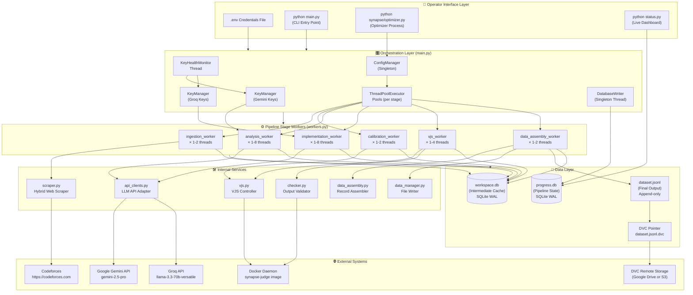
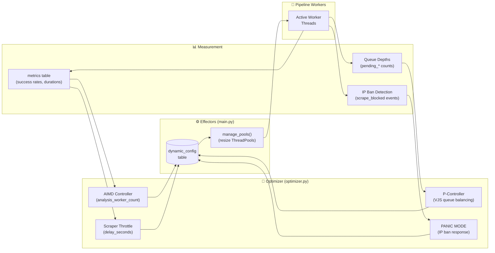
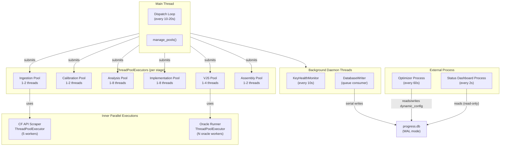

# System Architecture Diagram — Project Synapse

---

## High-Level System Architecture



---

## Self-Tuning Feedback Loop Architecture



---

## Concurrency Architecture



---

## File System Layout

```
axe-08-synapse/
│
├── main.py                 ← Orchestrator entry point
├── config.py               ← Static configuration constants  
├── status.py               ← Live terminal dashboard
├── create_database.py      ← One-time DB initializer
├── Dockerfile              ← synapse-judge image definition
├── requirements.txt        ← Python dependencies
├── .env                    ← API keys + credentials (gitignored)
│
├── synapse/                ← Core pipeline package
│   ├── __init__.py
│   ├── api_clients.py      ← Gemini + Groq API wrappers
│   ├── checker.py          ← Output comparison utility
│   ├── config_manager.py   ← Singleton dynamic config
│   ├── data_assembly.py    ← Golden record builder
│   ├── data_manager.py     ← dataset.jsonl writer
│   ├── database.py         ← Data Access Layer (DAL)
│   ├── database_writer.py  ← Async SQLite write queue
│   ├── key_manager.py      ← API key pool manager
│   ├── optimizer.py        ← Self-tuning optimizer
│   ├── scraper.py          ← Codeforces hybrid scraper
│   ├── vjs.py              ← Docker judge controller
│   └── workers.py          ← All stage worker functions
│
├── progress.db             ← Pipeline state (SQLite)
├── workspace.db            ← Intermediate cache (SQLite)
├── dataset.jsonl           ← Final output dataset
├── dataset.jsonl.dvc       ← DVC version pointer
│
├── .dvc/                   ← DVC configuration
├── chrome_profile/         ← Persistent Selenium session
├── data/                   ← (DVC-tracked data directory)
└── Documents/              ← Project documentation
    ├── SRS.md
    └── Diagrams/
        ├── 01_DFD.md
        ├── 02_ERD.md
        ├── 03_UseCases.md
        ├── 04_SequenceDiagrams.md
        ├── 05_ClassDiagram.md
        ├── 06_Architecture.md
        └── 07_Deployment.md
```
