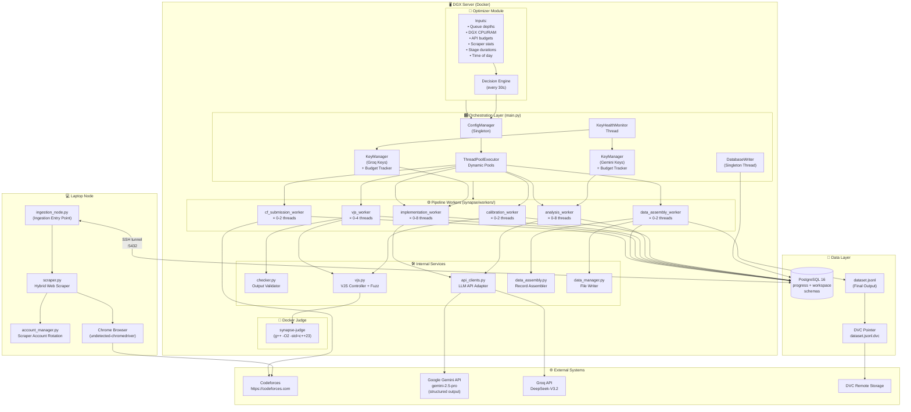
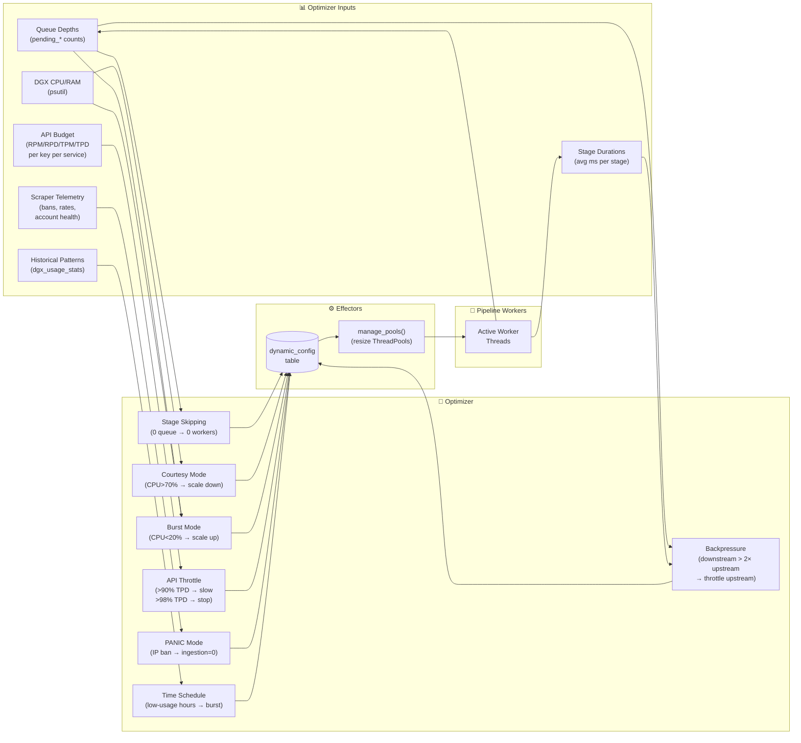
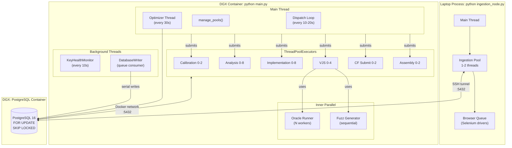

# System Architecture Diagram — Project Synapse v2.0

---

## High-Level System Architecture (Hybrid)



---

## Optimizer Feedback Loop Architecture



---

## Concurrency Architecture (Hybrid)



---

## File System Layout

```
Synapse/
│
├── main.py                 ← DGX orchestrator entry point
├── ingestion_node.py       ← Laptop ingestion entry point
├── config.py               ← Static configuration constants
├── status.py               ← Live terminal dashboard
├── create_database.py      ← DB initializer (--postgres flag)
├── Makefile                ← Deployment automation
├── Dockerfile              ← synapse-judge image
├── Dockerfile.pipeline     ← DGX pipeline container
├── docker-compose.yml      ← DGX: postgres + pipeline
├── requirements.txt        ← Full dependencies (laptop)
├── requirements-pipeline.txt ← Slim dependencies (DGX)
├── .env                    ← API keys + credentials (gitignored)
│
├── synapse/                ← Core pipeline package
│   ├── __init__.py
│   ├── api_clients.py      ← Gemini + Groq API wrappers
│   ├── checker.py          ← Output comparison utility
│   ├── config_manager.py   ← Singleton dynamic config
│   ├── data_assembly.py    ← Golden record builder
│   ├── data_manager.py     ← dataset.jsonl writer
│   ├── database.py         ← DAL (PostgreSQL + SQLite adapter)
│   ├── database_writer.py  ← Async write queue (PG/SQLite)
│   ├── key_manager.py      ← API key pool + budget tracker
│   ├── optimizer.py        ← Intelligent optimizer module
│   ├── scraper.py          ← Codeforces hybrid scraper
│   ├── account_manager.py  ← Scraper account rotation
│   ├── vjs.py              ← Docker judge controller
│   └── workers/            ← Pipeline worker package
│       ├── __init__.py     ← Conditional imports (DISABLE_INGESTION)
│       ├── _shared.py      ← Helpers + common imports
│       ├── ingestion.py    ← ingestion_worker()
│       ├── calibration.py  ← calibration_worker()
│       ├── analysis.py     ← analysis_worker()
│       ├── implementation.py ← implementation_worker()
│       ├── vjs.py          ← vjs_worker() + fuzz generator
│       ├── cf_submission.py ← cf_submission_worker()
│       └── assembly.py     ← data_assembly_worker()
│
├── tests/
│   ├── conftest.py         ← Shared fixtures (temp DB, sync writer)
│   ├── unit/               ← 56 unit tests
│   ├── integration/        ← 14 integration tests
│   └── e2e/                ← Pipeline smoke test
│
└── Documents/
    ├── SRS.md              ← v1 (preserved)
    └── v2/                 ← v2 documentation
        ├── SRS.md
        └── Diagrams/
```
