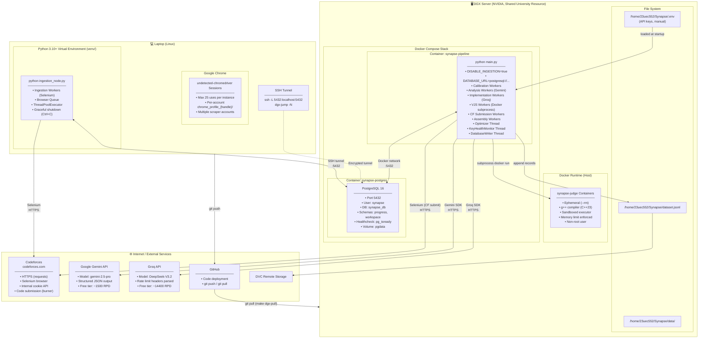

# Deployment Diagram — Project Synapse v2.0

---

## Deployment Architecture (Hybrid)



---

## Deployment Configuration

### Process Inventory

| Machine | Process | Command | Role |
|---------|---------|---------|------|
| Laptop | Ingestion Node | `python ingestion_node.py` | Scrapes CF, writes to PG via tunnel |
| Laptop | SSH Tunnel | `make tunnel` | Forwards DGX:5432 to localhost:5432 |
| DGX (Docker) | PostgreSQL | `docker compose up` service: postgres | Shared database |
| DGX (Docker) | Pipeline | `docker compose up` service: synapse | All processing stages + optimizer |

### Network Topology

| From | To | Protocol | Port | Purpose |
|------|----|----------|------|---------|
| Laptop | Codeforces | HTTPS | 443 | Scraping |
| Laptop | DGX | SSH | 22 | Tunnel to PostgreSQL |
| Pipeline Container | PostgreSQL Container | TCP | 5432 | Docker internal network |
| Pipeline Container | Gemini API | HTTPS | 443 | Analysis prompts |
| Pipeline Container | Groq API | HTTPS | 443 | Implementation prompts |
| Pipeline Container | Docker Daemon | Unix Socket | — | VJS judge calls |
| Pipeline Container | Codeforces | HTTPS | 443 | CF Submission Worker |
| Laptop | GitHub | HTTPS | 443 | Code deployment |

> **Note:** Neither machine opens inbound ports to the internet. DGX PostgreSQL is only reachable via SSH tunnel or Docker internal network.

### Resource Usage (Courtesy Guidelines)

| Scenario | Our CPU Target | Workers | Mode |
|----------|---------------|---------|------|
| DGX idle (CPU < 20%) | Up to 50% | Full scale | Burst Mode |
| DGX moderate (20-70%) | ~30% | Proportional | Normal Mode |
| DGX busy (CPU > 70%) | < 15% | Minimum | Courtesy Mode |
| Off-peak hours (2am-6am) | Up to 60% | Maximum | Scheduled Burst |

### Environment Variables (`.env`)

| Variable | Machine | Description |
|----------|---------|-------------|
| `GEMINI_API_KEYS` | DGX | Comma-separated Gemini API keys |
| `GROQ_API_KEYS` | DGX | Comma-separated Groq API keys |
| `DATABASE_URL` | Both | PostgreSQL connection string |
| `DISABLE_INGESTION` | DGX | `true` — skip ingestion/calibration imports |
| `CF_ACCOUNTS` | Laptop | `handle1:pass1,handle2:pass2` |
| `CF_SUBMISSION_ACCOUNTS` | DGX | Burner accounts for CF submission worker |

### Deployment Workflow

```
                 LAPTOP                          DGX
                   │                              │
  1. Edit code     │                              │
  2. Run tests     │                              │
  3. git push      │────── GitHub ──────────────►  │
                   │                              │  4. make dgx-pull
                   │                              │  5. make dgx-up (rebuild)
                   │                              │
  6. make tunnel   │ ═════ SSH tunnel ═══════════► │
  7. python        │                              │  (pipeline auto-restarts
     ingestion_    │ ◄═══ PostgreSQL queries ═══► │   with new code)
     node.py       │                              │
```

### Startup Order

```
# DGX (one-time setup)
1. ssh dgx-jump
2. git clone https://github.com/Axe-08/Synapse.git
3. cd Synapse && git checkout new_archi
4. Create .env with API keys + DATABASE_URL + DISABLE_INGESTION=true
5. docker compose up -d
6. DATABASE_URL=... python create_database.py --postgres

# DGX (every session)
1. make dgx-pull           (laptop terminal)
2. make dgx-up             (laptop terminal)

# LAPTOP (every session)
1. make tunnel              (background terminal)
2. python ingestion_node.py (main terminal)
```

### Shutdown

```
1. Ctrl+C on ingestion_node.py (laptop) → graceful drain
2. make dgx-down (laptop) → stops Docker containers
3. Ctrl+C on tunnel terminal
```
