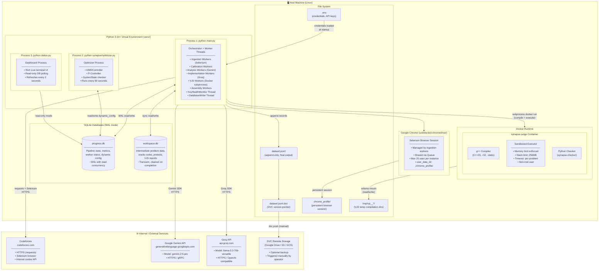

# Deployment Diagram — Project Synapse

---

## Deployment Architecture

This diagram shows how all components of Project Synapse are deployed on the host machine, including software environments and external service connections.



---

## Deployment Configuration Summary

### Process Inventory

| Process | Command | Role | Restartable? |
|---------|---------|------|-------------|
| Main Orchestrator | `python main.py` | Pipeline dispatch + worker threads | ✅ Yes (stateful DB) |
| Optimizer | `python synapse/optimizer.py` | Self-tuning loop | ✅ Yes |
| Dashboard | `python status.py` | Monitoring only | ✅ Yes |

### Port & Network Usage

| Component | Protocol | Direction | Endpoint |
|-----------|----------|-----------|----------|
| Codeforces scraper (requests) | HTTPS | Outbound | `codeforces.com` |
| Codeforces scraper (Selenium) | HTTPS | Outbound | `codeforces.com` |
| Gemini API | HTTPS/gRPC | Outbound | `generativelanguage.googleapis.com` |
| Groq API | HTTPS | Outbound | `api.groq.com` |
| Docker daemon | Unix Socket | Local | `/var/run/docker.sock` |
| SQLite databases | File I/O | Local | `./progress.db`, `./workspace.db` |

> **Note:** Project Synapse opens **no inbound network ports**. It is a purely outbound, client-side application.

### Resource Requirements

| Resource | Minimum | Recommended |
|----------|---------|-------------|
| CPU Cores | 4 | 8+ |
| RAM | 8 GB | 16 GB |
| Disk Space | 5 GB | 20 GB+ |
| Docker Memory per container | 256 MB (configurable) | — |
| Python Version | 3.10 | 3.11+ |
| Google Chrome | Latest stable | — |

### Environment Variables (`.env`)

| Variable | Required | Description |
|----------|----------|-------------|
| `GEMINI_API_KEYS` | ✅ | Comma-separated Gemini API keys |
| `GROQ_API_KEYS` | ✅ | Comma-separated Groq API keys |
| `CF_HANDLE` | ✅ | Codeforces login handle |
| `CF_PASSWORD` | ✅ | Codeforces login password |
| `MY_USER_AGENT` | ✅ | HTTP User-Agent string for respectful scraping |

### Docker Image (`synapse-judge`)

| Property | Value |
|----------|-------|
| Base Image | Minimal Debian/Alpine with GCC |
| Tag | `synapse-judge` |
| Build Command | `docker build -t synapse-judge .` |
| Ports Exposed | None |
| Run Mode | `--rm` (ephemeral, auto-deleted after each run) |
| User | Non-root (`--user uid:gid`) |
| Memory Limit | `--memory=<memory_limit_kb>k` (per-problem) |
| Stack Limit | `--ulimit stack=268435456` (256 MB) |
| Volume Mounts | `/app` — problem temp directory (read-only for execution) |

### Startup Order

```
1. docker build -t synapse-judge .
2. python create_database.py          (one-time)
3. python main.py                     (Terminal 1)
4. python synapse/optimizer.py        (Terminal 2)
5. python status.py                   (Terminal 3)
```

### Shutdown Procedure

```
1. Press Ctrl+C in Terminal 1 (main.py)
   → main.py catches KeyboardInterrupt
   → Gracefully drains all ThreadPoolExecutors
   → Quits all active browser instances
   → Stops DatabaseWriter thread
   → All in-progress problems reset on next startup
2. Press Ctrl+C in Terminal 2 (optimizer.py) and Terminal 3 (status.py)
```
