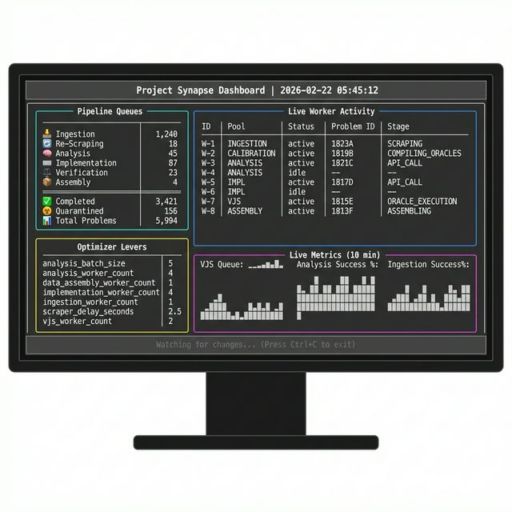
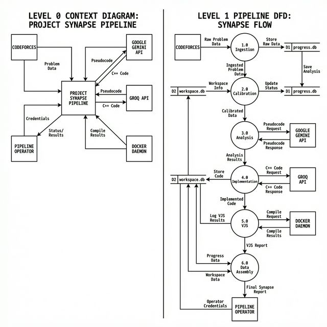
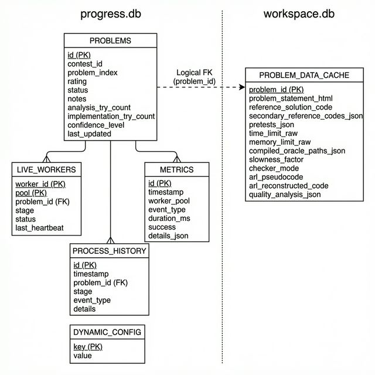
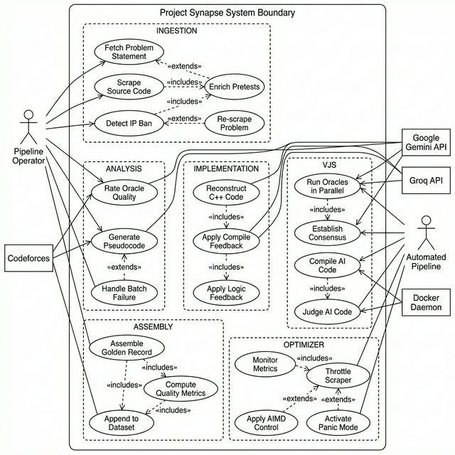
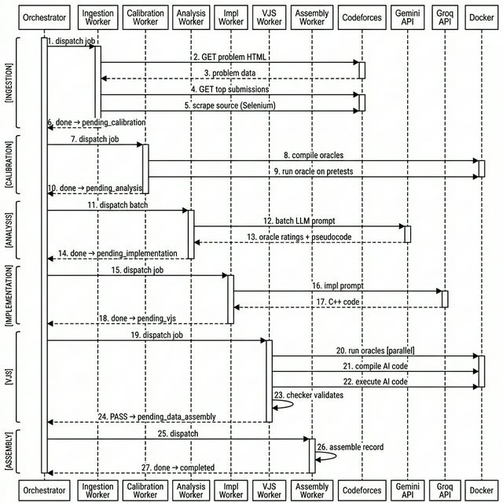
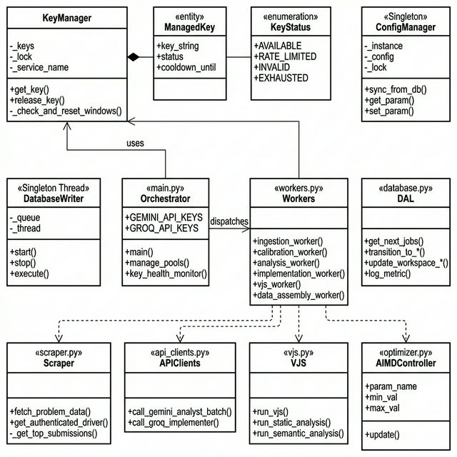
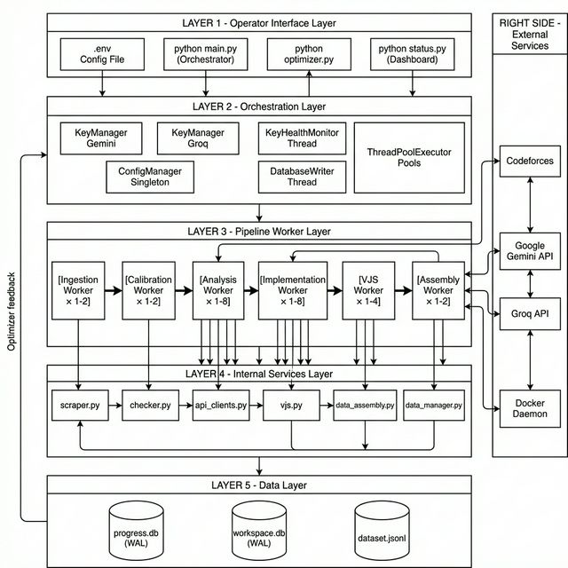
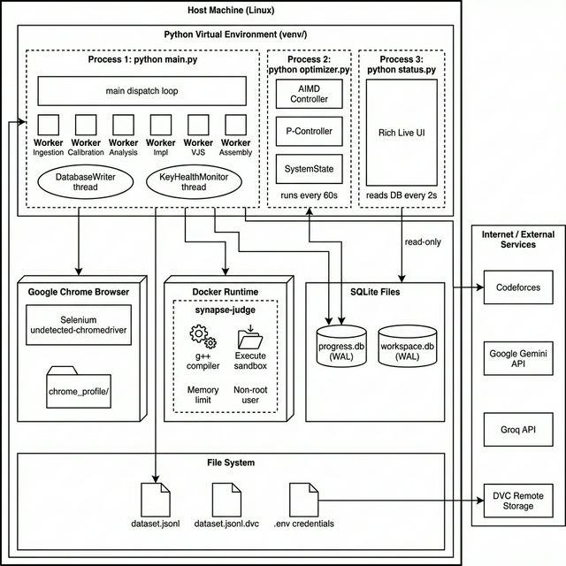

# Project Synapse — Wireframe Diagrams

All wireframe images are in `./Wireframes/`  
All Mermaid source diagrams are in `./Mermaid/`

---

## 00. Monitor UI Wireframe — Live Dashboard (`status.py`)

> The real-time terminal dashboard rendered by `python status.py`

**Layout:**
| Zone | Panel | Content |
|------|-------|---------|
| Header | Full width | Timestamp + title |
| Left-top | Pipeline Queues | Per-stage problem counts |
| Left-bottom | Optimizer Levers | Dynamic config values |
| Right-top | Live Worker Activity | Per-thread status table |
| Right-bottom | Live Metrics | Unicode sparkline graphs |
| Footer | Full width | Status + exit hint |

---

## 01. Data Flow Diagram (DFD)

> Level 0 (Context) + Level 1 (Pipeline stages with data stores)

[Mermaid Source →](./Mermaid/01_DFD.md)

---

## 02. Entity-Relationship Diagram (ERD)

> Both databases: `progress.db` (5 tables) and `workspace.db` (1 table)

[Mermaid Source →](./Mermaid/02_ERD.md)

---

## 03. Use Case Diagram

> Pipeline Operator, Automated Pipeline, and all External System interactions

[Mermaid Source →](./Mermaid/03_UseCases.md)

---

## 04. Sequence Diagram

> Full happy-path execution: Ingestion → Calibration → Analysis → Implementation → VJS → Assembly

[Mermaid Source →](./Mermaid/04_SequenceDiagrams.md)

---

## 05. Class Diagram

> All 12 classes/modules with attributes, methods, and UML relationships

[Mermaid Source →](./Mermaid/05_ClassDiagram.md)

---

## 06. System Architecture Diagram

> 5-layer architecture: Operator → Orchestration → Workers → Services → Data

[Mermaid Source →](./Mermaid/06_Architecture.md)

---

## 07. Deployment Diagram

> Host machine topology: 3 processes, Docker, SQLite, Chrome, external services

[Mermaid Source →](./Mermaid/07_Deployment.md)
